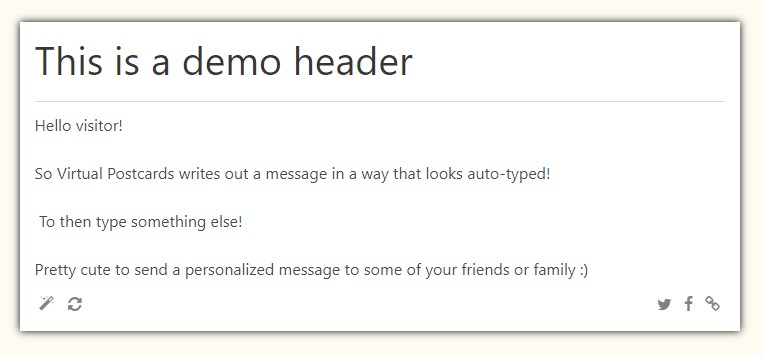

# Virtual Postcards

[Demo here](https://thomasdeluca.nl/virtualpostcards/#eyJoIjoiVGhpcyBpcyBhIGRlbW8gaGVhZGVyIiwidCI6IkhlbGxvIHZpc2l0b3IhXG5cblNvIFZpcnR1YWwgUG9zdGNhcmRzIHdyaXRlcyBvdXQgYSBtZXNzYWdlIGluIGEgd2F5IHRoYXQgbG9va3MgYXV0by10eXBlZCFcblxuKipZb3UgY2FuIG1ha2UgdGV4dCB0eXBlIGFuZCBkZWxldGUqKiBUbyB0aGVuIHR5cGUgc29tZXRoaW5nIGVsc2UhXG5cblByZXR0eSBjdXRlIHRvIHNlbmQgYSBwZXJzb25hbGl6ZWQgbWVzc2FnZSB0byBzb21lIG9mIHlvdXIgZnJpZW5kcyBvciBmYW1pbHkgOikiLCJiIjoiIn0=)

## What is Virtual Postcards?

Virtual Postcards a small application auto-types a message of your choice. Share the created message through twitter, Facebook or by copying the link!

## Why?

I wrote Virtual Postcards as an experiment to get my feet wet with Vue. It's an MVP, with a lot of inline CSS styles and whatnot. 